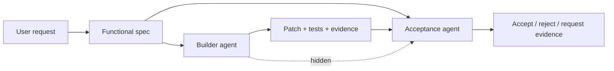

# Acceptance Agent

Spec-visible, implementation-blind verification for multi-agent coding workflows.

This repository is a public companion artifact for a private workflow pattern: an
acceptance agent that reads the user request, functional specification, tests,
and final diff, but not the implementation conversation that produced the diff.
The goal is to reduce structural collusion between builder agents and reviewer
agents by making the verifier information-asymmetric.

## Why It Exists

Multi-agent coding pipelines often fail when every agent shares the same
context, assumptions, and partial explanations. A reviewer that reads the same
conversation as the builder can inherit the builder's framing and miss the same
contract gap.

The acceptance agent is deliberately deprived of that implementation narrative.
It checks the final artifact against the spec and evidence, not against the
builder's story about why the artifact should be accepted.

## Core Mechanism

The dashed edge is intentionally absent in the real workflow: the acceptance
agent does not read builder scratchpads, negotiation, or implementation
rationales.

## Repository Map

- `docs/problem.md`: failure mode this pattern targets.
- `docs/architecture.md`: information flow and acceptance contract.
- `docs/security-model.md`: what is intentionally excluded from the public
  artifact and from the verifier.
- `docs/examples.md`: toy tasks that illustrate the mechanism.
- `examples/`: sanitized task fixtures.
- `eval/`: benchmark and ablation plan.
- `prompts/acceptance_agent.yaml`: minimal prompt contract for the verifier.

## Public Boundary

This repository contains the pattern, toy examples, and evaluation design. It
does not contain private production repositories, customer data, trading
strategies, model credentials, or unpublished operational logs.

## Status

Early public companion repo. The initial artifact is intentionally small:
document the mechanism first, then add runnable toy evaluations once the public
surface is stable.
